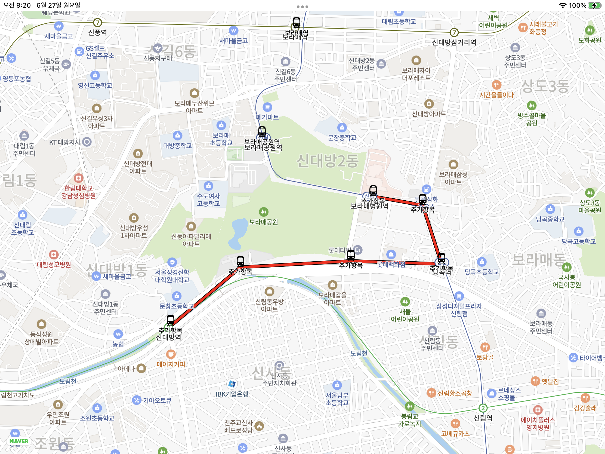

# NaverMapSwift

네이버지도 iOS SDK를 SwiftUI로 래핑한 패키지.

## 지원하는 기능

- 카메라 이동 (이니셜라이저 -> `cameraPosition: Binding<CameraPosition>`)

- Path 표시 (이니셜라이저 -> `lineCoordinates: [CLLocationCoordinate2D]`)

- Path 스타일화 (모디파이어 -> `pathStyle`)

- Marker 표시 (이니셜라이저 -> `markerItems`, `markerContent`)

- Map 탭 (모디파이어 -> `onMapTap(perform:)`)

- 회전, 틸트 잠금 (모디파이어 -> `rotateGestureEnabled(:)`, `tiltGestureEnabled(:)`)




```swift
struct ContentView: View {
    @State var lineCoordinates = [CLLocationCoordinate2D]()
    @State var locations = [
        AnnotatedItem(name: "보라매공원역", coordinate: .init(latitude: 37.4954, longitude: 126.9182)),
        AnnotatedItem(name: "보라매역", coordinate: .init(latitude: 37.4999, longitude: 126.9200))
    ]
    @State var cameraPosition = NMFCameraPosition(
        NMGLatLng(lat: 37.4922, lng: 126.9194),
        zoom: 14.6
    )
    var body: some View {
        NaverMap(
            cameraPosition: $cameraPosition,
            lineCoordinates: lineCoordinates,
            markerItems: locations,
            markerContent: { location in
                NaverMapMarker(position: location.coordinate)
                    .image(.init(systemName: "tram.fill")!)
                    .captionText(location.name)
            }
        )
        .tiltGestureEnabled(false)
        .rotateGestureEnabled(false)
        .onMapTap { coordinate in
            lineCoordinates.append(coordinate)
            locations.append(.init(name: "추가항목", coordinate: coordinate))
        }
        .pathStyle {
            NaverMapPath()
                .color(.red)
        }
    }
}

struct AnnotatedItem: Identifiable {
    let id = UUID()
    var name: String
    var coordinate: CLLocationCoordinate2D
}
```

